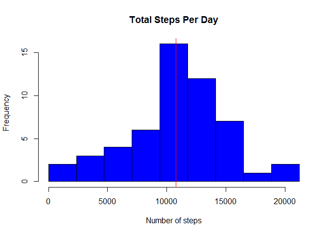
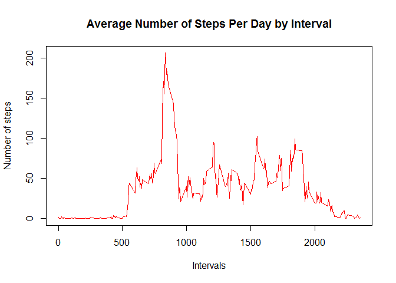
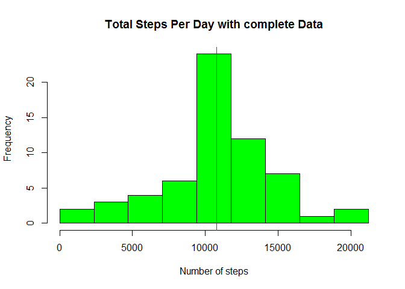
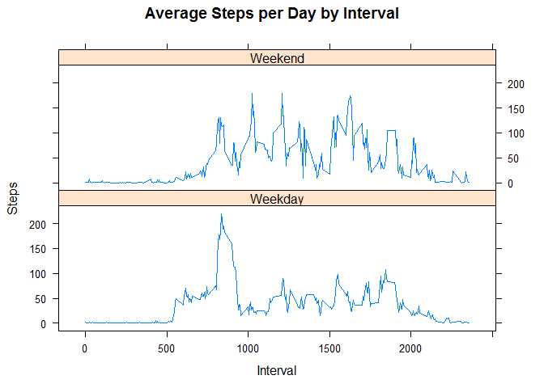

# Reproducible Research: Peer Assessment 1
BY SAMMY KARIUKI  
   
   
### Loading and preprocessing the data  
   


```r
activity_df <- read.csv(unzip("activity.zip")) # First unzip the dataset
```
   
     
### What is mean total number of steps taken per day?   
  

```r
step_per_day <- aggregate(steps ~ date , data = activity_df, FUN = sum)  

step_mean <- mean(step_per_day$steps)

step_median <- median(step_per_day$steps)
```
The mean of steps per day is 1.0766189\times 10^{4} while the median is 10765.

Now lets plot a histogram

```r
hist(step_per_day$steps, main = "Total Steps Per Day",
     
     breaks = seq(0, max(step_per_day$steps), l = 10),
     
     col = "blue", xlab = "Number of steps")

abline(v = step_mean, col = "red") # Add  red line which is the mean
```

<!-- -->
   
   
### What is the average daily activity pattern?   
   
   
+ Calculate average steps for each interval for all days  
    
+ plot the Average Number Steps per Day by Interval.


```r
step_per_interval <- aggregate(steps ~ interval, activity_df, mean)

plot(step_per_interval$interval, step_per_interval$steps, type = "l", col = "red", 
     
     main = "Average Number of Steps Per Day by Interval",
     
     xlab = "Intervals", ylab = "Number of steps")
```

<!-- -->

Find interval with most average steps.

```r
max_interval <- step_per_interval[which.max(step_per_interval$steps), 1]
```
  
    
The 5-minute interval, on average across all the days in the dataset, contains the maximum number of steps is 835   
    

### Imputing missing values   
   
+ Calculate the total number of rows with NAs    

```r
incomplete_row <- sum(!complete.cases(activity_df))
```
  
The total number of rows with NAs is 2304   
   
+ Fill the missing data strategy    
  
Here I choose to use the average of steps by interval which is a close representation of a specific observation compared to the average by day.    

To do this I defined a function *Fill_missing* which takes two arguements:  

1. df - The original dataframe with missing values for my analysis it is *activity_df*   

2. avg_df - The dataframe with averages for this case by interval that is *step_per_interval*    


```r
Fill_missing <- function(df, avg_df){
  
  for (i in 1:nrow(df)){
    
    if (is.na(df[i, 1])){
      
      row_interval <- df[i, "interval"]
      
      df[i, "steps"] <- avg_df[avg_df$interval== row_interval, "steps"]
      
    }
  }
  
  df
}
```
   
   
+ Create a new dataset that is equal to the original dataset but with the missing data filled in.  
   
* Lets name it *complete_df*

```r
complete_df <- Fill_missing(activity_df, step_per_interval) 

# lets make sure no missing data remained

sum(!complete.cases(complete_df))
```

```
## [1] 0
```
+ What is mean total number of steps taken per day after filling the missing value      
    

```r
complete_step_per_day <- aggregate(steps ~ date , data = complete_df, FUN = sum)  

complete_step_mean <- mean(complete_step_per_day$steps)

complete_step_median <- median(complete_step_per_day$steps)
```
   
The mean of steps per day before filling missing values is 1.0766189\times 10^{4}  and 1.0766189\times 10^{4} after filling. From this we can say there was no change in means.      
    
For median of steps per day before filling missing is10765 while after is 1.0766189\times 10^{4}. From this we can see that the median change to move towards the mean.       
   
Now lets plot a histogram

```r
hist(complete_step_per_day$steps, main = "Total Steps Per Day with complete Data",
     
     breaks = seq(0, max(complete_step_per_day$steps), l = 10),
     
     col = "green", xlab = "Number of steps")

abline(v = complete_step_mean, col = "red") # Add  red line which is the mean
```

<!-- -->
    
   
### Are there differences in activity patterns between weekdays and weekends?   

Here we create a new factor column of weekday and Weekend      

```r
weekends <-  c("Suturday", "Sunday")

complete_df$Day_or_end <- as.factor(ifelse(is.element(weekdays(as.Date(complete_df$date)), weekends),"Weekend", "Weekday"))

# For reminder lets see a preview of or data
head(complete_df)
```

```
##       steps       date interval Day_or_end
## 1 1.7169811 2012-10-01        0    Weekday
## 2 0.3396226 2012-10-01        5    Weekday
## 3 0.1320755 2012-10-01       10    Weekday
## 4 0.1509434 2012-10-01       15    Weekday
## 5 0.0754717 2012-10-01       20    Weekday
## 6 2.0943396 2012-10-01       25    Weekday
```
+ Lets calculate and plot the average number of steps taken per interval, averaged across all weekday days or weekend days   


```r
step_by_interval_factor <- aggregate(steps ~ interval + Day_or_end, complete_df, mean)
head(step_by_interval_factor)
```

```
##   interval Day_or_end      steps
## 1        0    Weekday 1.94375222
## 2        5    Weekday 0.38447846
## 3       10    Weekday 0.14951940
## 4       15    Weekday 0.17087932
## 5       20    Weekday 0.08543966
## 6       25    Weekday 1.38981844
```
### plot using Lattice

```r
library(lattice)

xyplot(step_by_interval_factor$steps ~ step_by_interval_factor$interval |
         
         step_by_interval_factor$Day_or_end, layout = c(1, 2), type = "l",
       
       main="Average Steps per Day by Interval", xlab =  "Interval", ylab = "Steps")
```

<!-- -->

